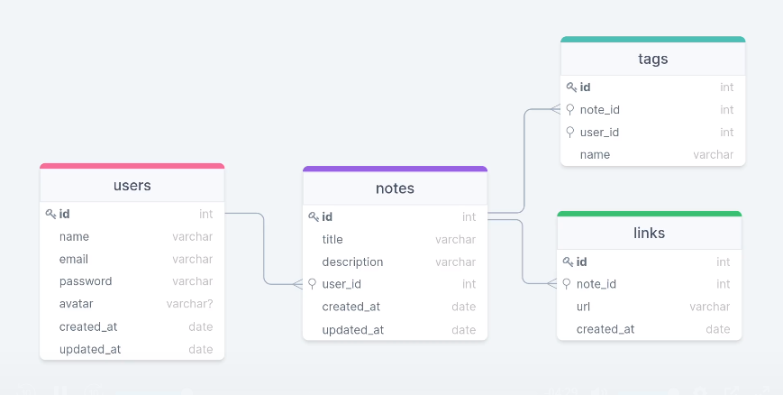

<strong><h1 align="center"> API RoketNote </h1></strong>

## Diagrama

Abaixo diagrama utiliazado para criação do banco de dados:

  

## 🚀 Tecnologias

Esse projeto foi desenvolvido com as seguintes tecnologias:

- Node.js
- Express
- Sqlite3
- Nodemon
- Git e Github
- Postman

## 🚀 Pré-requisitos

Antes de começar, você vai precisar ter instalado em sua máquina as seguinte ferramenta:

